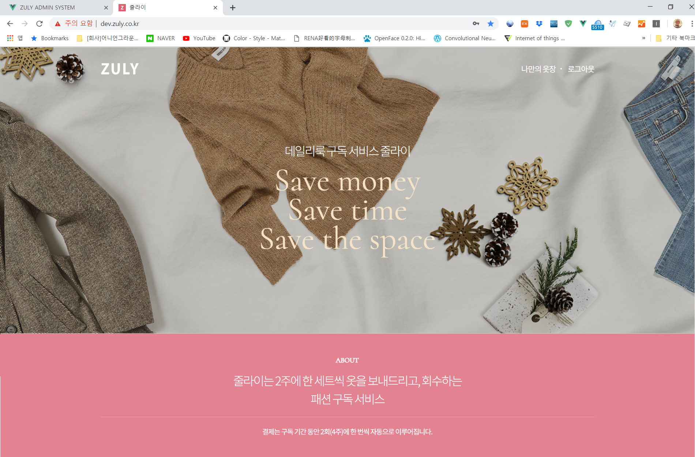
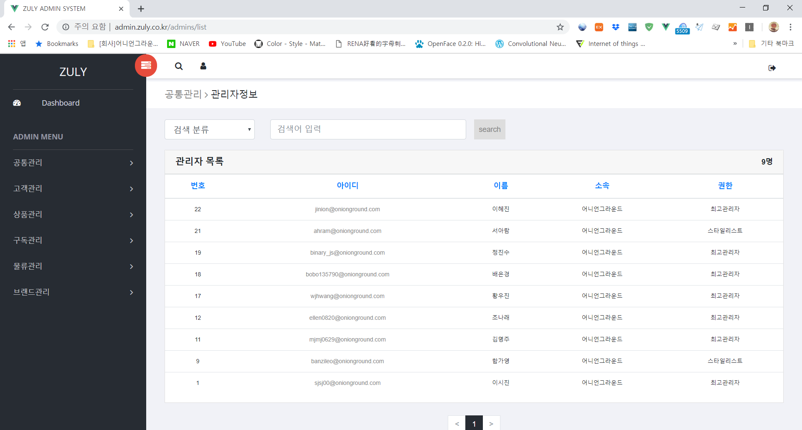

# PORTFOLIO

## [Creatrip (2019~2019)](https://www.creatrip.com/)
__Web Project__ : 중화권 방한객 여행정보 플랫폼 크리에이트립(고객용, 관리자용)

크리에이트립은 중화권 방한객을 위한 한국 여행정보를 제공해주는 여행정보 플랫폼입니다.

여행정보 제공 외에도 한국 여행시 필요한 액티비티 예약이나 배달 음식을 주문해주는

서비스를 제공했으며 하반기에는 숙소 예약 서비스를 준비했습니다.

저는 크리에이트립에서 백엔드 개발을 주로 담당했으며 관리자 페이지의 경우

프론트 엔드 개발까지 담당했습니다.

Node.js, Vue.js, AWS, MariaDB, Nuxt.js, Sequelize ORM, GraphQL

## [ZULY (2018~2019)](https://github.com/narae-develop/portfolio/tree/master/ZULY)
__Web Project__ : 패션 구독 서비스 줄라이(고객용, 관리자용)

줄라이는 여성의 옷을 2주에 한번씩 상하의 세트 혹은 원피스, 코트 등을 추천해서

새벽배송을 통해 고객의 집 문 앞에 걸어주는 서비스입니다.

저는 해당 서비스에 2018년 3월부터 개발에 참여해서 2018년 9월 5일에 오픈했고

2019년 3월 31일까지 서비스를 운영 했습니다.

Node.js, Vue.js, AWS, MariaDB

## [AccountBookManage (2017)](https://github.com/narae-develop/AccountBookManage)

__Spring Project__ : Spring Security를 적용한 장부관리 프로그램

Spring Framework, Java, Jquery, Ajax, Bootstrap, Mybatis, Mysql

## [Cafe Order (2016)](https://github.com/narae-develop/CafeOrder)

__Android Project__ : 카페 주문 안드로이드 앱

Android Marshmallow, Java, JPA, SQLite 3.0

## [Dragon Slayer (2016)](https://github.com/narae-develop/dragon-slayer)

__IOS Project__ : Sprite Kit 를 사용한 RPG 게임

Swift 2.0, SQLite 3.0, Sprite Kit

## [Seoul Travel (2016)](https://github.com/narae-develop/SeoulTravelClient)

__Android Project__ : 서울 관광지를 소개하는 안드로이드 앱

Android Marshmallow, Java, JPA

## [User Chat (2016)](https://github.com/narae-develop/userChat)

__Spring Project__ : Ajax polling 기법을 이용한 채팅 프로그램

Spring Framework, Java, Jquery, Ajax, Bootstrap, Mybatis, Mysql

## [Bird Shot (2015)](https://github.com/narae-develop/BirdShot)

__IOS Project__ : Swift 2.0 을 사용한 슈팅 게임

Swift 2.0, SQLite 3.0

## Nonghyup New Generation (2013~2014)
__Hybrid Application Project__ : 농협 차세대 개발 참여 및 고도화 프로젝트 참여

2013년 2월부터 2014년 2월까지 농협 차세대 프로젝트 프로젝트 참여했으며

이후, 2014년 8월부터 2014년 12월까지 농협 차세대 어플리케이션을 고도화하는 프로젝트에 참여했습니다.

스마트뱅킹, 스피드뱅킹은 차세대 프로젝트때 새로 만들었으며 스마트기업뱅킹은 대응개발을 했습니다.

- 스마트뱅킹 [아이폰](https://itunes.apple.com/kr/app/nh스마트뱅킹/id1444712671?mt=8) | [안드로이드](https://play.google.com/store/apps/details?id=nh.smart.banking&hl=ko)
- 스피드뱅킹 [아이폰](https://itunes.apple.com/kr/app/nh-글로벌-스피드뱅킹/id836365212?mt=8) | [안드로이드](https://play.google.com/store/apps/details?id=nh.smart.speed&hl=en_US)
- 스마트기업뱅킹 [아이폰](https://itunes.apple.com/kr/app/nh농협-기업스마트뱅킹/id572186085) | [안드로이드](https://play.google.com/store/apps/details?id=nh.smart.nhibzbanking&hl=ko)

Morpheus, JavaScript, JQuery

## [국회도서관 (2011~2012)](https://www.nanet.go.kr/main.do)
__Web Project__ : 국회도서관 사이트 유지보수

저는 국회도서관을 이용하는 유저 페이지 유지보수 및 

직원들이 사용하는 인트라넷 화면을 유지보수했습니다.

JSP, JAVA, Informix
