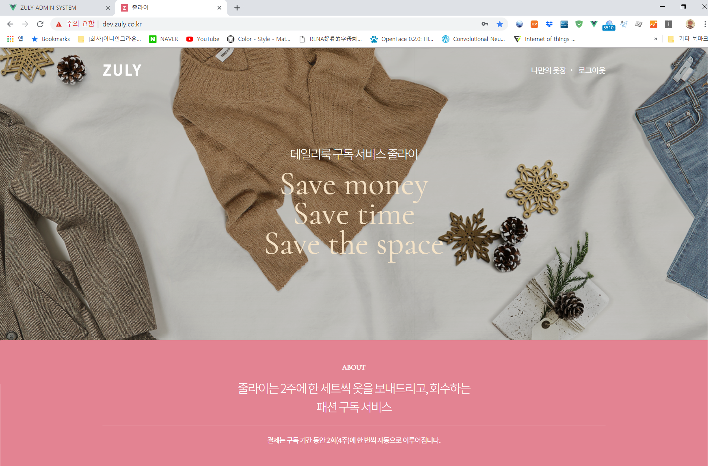
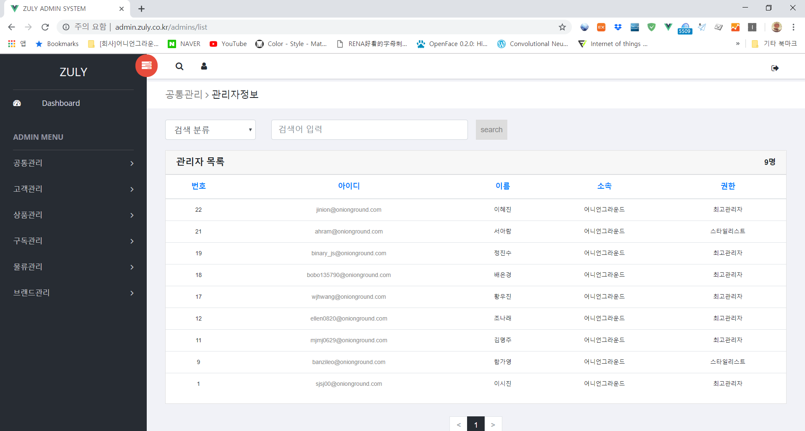

# ZULY

패션 구독 서비스 줄라이(고객용, 관리자용)

## Description

줄라이 서비스는 여성의 옷을 2주에 한번씩 상하의 세트 혹은 원피스, 코트 등을 추천해서

새벽배송을 통해 고객의 집 문 앞에 걸어주는 서비스입니다.

저는 해당 서비스에 2018년 3월부터 개발에 참여해서 2018년 9월 5일에 오픈했고

2019년 3월 31일까지 서비스를 운영 했습니다.

## ScreenShot

user 폴더와 admin 폴더에 각각의 상세 화면을 볼 수 있습니다.

## Skill

Node.js, Vue.js, AWS, MariaDB

프론트 엔드 기술로 Vue.js를 활용했으며, 백 엔드 기술로는 Node.js(Koa)를 활용했습니다.